# CLAUDE.md

This file provides guidance to Claude Code (claude.ai/code) when working with code in this repository.

## Build & Test Commands

```bash
make                    # Build all 5 binaries to ./build/
make magid              # Build the main vsc-node binary
make test               # Quick unit tests across the repo (< 5 min, the everyday check)
make test-full          # Every runnable test: quick first, then slow (clusters/docker/zk)
make test-regression    # Node-wide devnet regression (TestFullNetworkRegression, ~70-110 min, Docker)
go test ./...           # Run all tests directly
go test ./modules/tss/  # Run tests in a specific package
go run github.com/99designs/gqlgen generate  # Regenerate GraphQL code
```

`make test` skips the slow packages listed in `SLOW_PACKAGES` in the Makefile
(libp2p clusters, docker devnet, zk proving, multi-second suites) and the
non-host-runnable ones (`modules/wasm/e2e/go_wasm*` wasm guests,
`modules/oracle/price` WIP). New packages are quick by default — add genuinely
slow ones to `SLOW_PACKAGES`.

`make test-regression` runs the single `TestFullNetworkRegression` (in
`tests/devnet`) with a 130m timeout (TSS stages wait on ~5-min epoch boundaries
since reshares only fire when an election advances the epoch). It spins up a
7-node docker devnet once and
drives a multi-stage scenario (ledger op storm, contract + TSS lifecycle,
elections with witness churn, chaos) under recoverable faults, asserting
cross-node consistency. It is too long for the 30m slow budget, so `test-full`
`-skip`s it (via `SLOW_SKIP`/`REGRESSION_TEST`) — run it deliberately.

Currently-failing tests are temporarily excluded from both targets so they stay
green, tracked in the Makefile for fixing (remove each once fixed):

- `KNOWN_FAILING_PACKAGES` — whole packages: `modules/e2e` (missing wasm
  artifact), `modules/announcements` (stale Hive mock), `modules/hive/streamer`
  (test-suite rehab), `modules/p2p` (gossipsub `Test` hang).
- `KNOWN_FAILING_TESTS` — individual tests skipped via `go test -skip`:
  `TestFuzzAll` (wasm/e2e RC drain), `TestBasicP2P` (data-availability harness).

Both targets use `go test -count=1` (no result caching — the cache key misses
external state like MongoDB/libp2p, so a cached `ok` could be stale) and select
only packages that contain test files (no `[no test files]` noise; test-less
packages are built by `make`, not these targets).

Note: `make test-full` still runs `modules/tss/tests` (6-node integration) and
`tests/devnet` (docker), which are long-running and not validated by the quick
check.

## Sensitive Files

**Never read `identityConfig.json`** — it contains private keys.

## Architecture

This is the **Go VSC (Magi) Node**, a layer-2 network on top of the Hive blockchain. The main daemon is `magid` (cmd/vsc-node).

### Core Flow (cmd/vsc-node/main.go)

Init DB + P2P + DataLayer → Start Hive block consumer (L1 listener) → Create StateEngine → Wire up modules (TSS, elections, block producer, oracle, transactions) → Start GraphQL API + P2P listener

### Key Directories

- **cmd/** — 5 binaries: `vsc-node` (magid), `contract-deployer`, `genesis-elector`, `devnet-setup`, `mapping-bot`
- **lib/** — Shared libraries: datalayer (IPFS), CBOR serialization, DIDs, Hive client, pubsub, IPC, logging
- **modules/** — 24 core modules (see below)

### Module Groups

**Consensus & Network**: `tss/` (threshold signatures, BFT consensus), `p2p/` (libp2p networking), `announcements/` (node discovery)

**State & Blocks**: `state-processing/` (central transaction/contract engine), `block-producer/`, `transaction-pool/` (mempool), `hive/` (L1 block streaming)

**Contract Execution**: `wasm/` (WasmEdge runtime), `contract/` (execution context)

**Ledger**: `ledger-system/` (token balances), `rc-system/` (resource credits)

**Elections & Data**: `election-proposer/`, `data-availability/` (proofs, client/server), `gateway/` (P2P multisig)

**API & Config**: `gql/` (GraphQL API, schema in `modules/gql/schema.graphql`), `config/`, `common/` (system config per network), `db/` (MongoDB collections)

### Networks

Mainnet (`vsc-mainnet`), Testnet (`vsc-testnet`), Devnet (`vsc-devnet`)— network-specific params in `modules/common/system-config/`

### GraphQL

Schema: `modules/gql/schema.graphql`. Auto-binds DB models via `gqlgen.yml`. Playground available at the GQL server URL + `/sandbox`.

---

# BEFORE YOU TOUCH ANY TSS CODE

Read this section completely. These three constraints govern everything in the TSS module. Every bug we've shipped violated one of them.

## Constraint 1: ALL-Parties Required (The Fundamental Constraint)

**tss-lib requires 100% participation from ALL listed parties. There is no threshold-based advancement.**

`CanProceed()` in btss (`ecdsa/resharing/rounds.go:75-85`, identical in `eddsa/resharing/rounds.go:70-80`):

```go
func (round *base) CanProceed() bool {
    if !round.started { return false }
    for _, ok := range append(round.oldOK, round.newOK...) {
        if !ok { return false }
    }
    return true
}
```

Every `oldOK[j]` and every `newOK[j]` must be true before any round advances. One missing message from one listed party = round blocked until 2-minute timeout. The threshold (`ceil(N*2/3)-1`, e.g., 12 for 19 nodes) governs the math (Lagrange interpolation), NOT the protocol. The protocol requires ALL listed parties.

The SSID reinforces this cryptographically. At `ecdsa/resharing/rounds.go:145`:

```go
ssidList = append(ssidList, round.Parties().IDs().Keys()...)
```

`round.Parties()` returns the OLD committee PeerContext (`tss/params.go:66,144-145`). The SSID is a SHA-512/256 hash of every old party's Key, plus BigXj, NTildej, H1j, H2j, round number, and nonce. Round 2 (`round_2_new_step_1.go:44-52`) verifies SSID from ALL old parties byte-for-byte. One party with a different Key = `WrapError("ssid mismatch", Pj)` = session poisoned for every node.

**Consequence: the party lists passed to `btss.NewReSharingParameters()` at `dispatcher.go:247-256` (old) and `dispatcher.go:285-294` (new) are a contract. Every party MUST send valid messages in every round. Every node MUST construct identical party lists — same members, same order, same epoch-modified Keys. Any divergence silently poisons the session for all nodes.**

## Constraint 2: Party List Must Be Identical Across All Nodes

**What is ALLOWED to modify the party list (deterministic — same on all nodes):**

- On-chain blame exclusion: `blamedAccounts[member.Account]` — from Hive blame commitments (`tss.go:718-722`, `741`)
- On-chain ban exclusion: `blameMap.BannedNodes[member.Account]` — from `BlameScore()` which reads only on-chain data (`tss.go:745,767`)
- On-chain commitment bitset: which members were in the prior keygen/reshare (`tss.go:730-739`)
- **Gossip readiness attestations** (`gossipAttestations` → `readyAccounts`) — a per-member entry is a single BLS-signed claim that converges across all nodes before the session. ALLOWED, REQUIRED, and the most-often mis-"fixed" input here — see "Gossip readiness is convergent and REQUIRED" below.

**What is FORBIDDEN to modify the party list (non-deterministic — differs per node):**

- Instantaneous, unsynchronized per-node probes — a live RPC ping, libp2p `Connectedness()`, or local witness-DB sync state. Each node samples a different instant, so the sets never line up → divergent party lists → SSID mismatch → silent failure (the codebase warns of exactly this: _"excluding them non-deterministically causes SSID mismatch between nodes"_).

The dividing line: a FORBIDDEN input is sampled locally and never reconciled. The gossip readiness set (last ALLOWED bullet) is the opposite — a signed claim that every node converges on _before_ the session. That distinction is the whole reason gossip is allowed, so it is spelled out next.

### Gossip readiness is convergent and REQUIRED — do NOT "fix" it toward determinism

🛑 **This is the single most repeated mistake in this module.** More than once, a session has read the FORBIDDEN list, labeled the gossip readiness filter a "non-determinism bug," and proposed replacing it with an on-chain / election-snapshot source "for determinism." **That is wrong every time.** It shipped once as **GV-H8** (`selectReshareNewCommittee`) and was **reverted** — for regressing liveness (offline-member timeouts) and version accuracy (stale snapshot vs. live attested version) to solve a non-problem. Do not re-derive it.

**It is REQUIRED — because of Constraint 1.** btss demands 100% participation from ALL listed parties in BOTH committees (every `oldOK[j]` and `newOK[j]`). So the list can **never** be "all on-chain election members": any member offline at session time forces a full 2-minute `CanProceed` stall and almost always a failed session. You MUST narrow the list to nodes actually online/ready. Readiness is load-bearing for liveness; deleting it "for determinism" guarantees a 2-minute timeout per offline member, every cycle.

**It is CONVERGENT, not a per-node probe.** The readiness set is an eventually-convergent BLS-gossip protocol engineered so all honest nodes hold the SAME set by session time:

- **BLS-signed attestations** (`ReadyAttestation`, `signReadyAttestation` / `verifyAttestation`): each member's readiness + running version is ONE signed claim. Every receiver stores the byte-identical signed object — nothing about a member's entry is per-node except _whether you've received it yet_. The version carried is the node's **live** `RunningVersion()`, both deterministic across receivers (one signed value) and more accurate than any election snapshot.
- **Amplification** (`broadcastGossipBundle`): every member re-broadcasts the FULL bundle of known attestations every block, so a node that missed one catches up within a block or two.
- **Settle window** (`DEFAULT_SETTLE_BLOCKS = 3`): in the last 3 blocks before the target, NEW attestations are REJECTED — only re-gossip continues (enforced on both the send and receive paths). This freezes the set well before the session, so it converges.

**Residual divergence is HARMLESS — fail-and-retry, never silent corruption.** Convergence is overwhelming but not guaranteed (a partition, or an attestation arriving right at the settle boundary, can still differ). When it does, nothing is corrupted silently: a mismatched list yields an SSID mismatch (Constraint 1) or a share-verification failure, the session simply FAILS, and it RETRIES at the next rotation (`TSS_ROTATE_INTERVAL` blocks) — by which point the set has almost certainly converged. The price of a rare divergence is one wasted, auto-retried session; the price of "determinizing" it by including every on-chain member is a guaranteed 2-minute stall per offline member, forever. The design trades a rare, free, self-healing retry for everyday liveness. **Do not invert that trade.**

**Before changing readiness / party-list selection, answer in writing:** _"Does my change keep each per-member readiness entry a single signed claim that converges via the settle window, and does it preserve fail-and-retry rather than forcing offline members into the list?"_ If you are about to swap the live gossip readiness set for an on-chain / election-snapshot source, STOP — you have re-derived the reverted GV-H8.

## Constraint 3: Consensus Boundary — Identical CIDs Required

**`result.Serialize()` → CBOR → CID must produce the identical byte sequence on every node.** If even one node produces a different CID, its BLS signature doesn't match the leader's commitment, and that signature doesn't count toward the 2/3 threshold.

The BLS collection at `tss.go:1276-1376` works as follows:

1. Leader serializes its result: `result.Serialize()` → `EncodeDagCbor()` → `HashBytes()` → CID
2. Leader broadcasts `ask_sigs` via pubsub (one-shot, no retry) (`tss.go:1299-1305`)
3. Each node independently: looks up its own `sessionResults[sessionId]` → calls its own `Serialize()` → computes its own CID → BLS-signs ONLY if its CID matches (`p2p.go:92-131`)
4. Leader collects signatures: needs `signedWeight*3 >= weightTotal*2` within 6 seconds (`tss.go:1323`)

**Why CIDs diverge — the full chain:**
Different party lists → different PartyIDs → different SSID → different protocol errors → different `WaitingFor()` results → different `TimeoutResult.Culprits` → different `setToCommitment()` bitsets → different `BaseCommitment` → different CBOR → different CID → BLS signature mismatch → `waitForSigs` times out → commitment never lands on Hive → no error logged → failure is completely silent.

**What feeds into Serialize() (must be identical across nodes):**

- `TimeoutResult.Culprits` — from `WaitingFor()` (NON-DETERMINISTIC if party lists differ)
- `ErrorResult.tssErr.Culprits()` — from btss error (NON-DETERMINISTIC, depends on message arrival)
- `ReshareResult.Commitment` — from `setToCommitment(newParticipants, newEpoch)` (DETERMINISTIC if newParticipants identical)
- `setToCommitment()` itself — uses `GetElection(epoch)` (ON-CHAIN, deterministic)
- `Epoch` field — `dispatcher.newEpoch` (DETERMINISTIC)

---

# TSS Reshare Flow — Complete Map

All line numbers against `main` @ `f850533`. btss lines against `bnb-chain/tss-lib/v2@v2.0.2`.

## Flow Diagram

```mermaid
flowchart TD
    subgraph HIVE["Hive L1 Chain"]
        HB["Hive Block N"]
    end

    subgraph CONSUMER["Block Consumer (consumer.go:45-57)"]
        TICK["BlockTick (async goroutine)<br/>tss.go:138"]
        SE["StateEngine.ProcessBlock<br/>state_engine.go"]
        HB -->|"1. ticks fire FIRST"| TICK
        HB -->|"2. state engine SECOND"| SE
    end

    subgraph STATEENG["State Engine — vsc.tss_commitment handler"]
        PARSE["Parse JSON → SignedCommitment<br/>state_engine.go:823-835<br/>✓ DETERMINISTIC"]
        BLSV["BLS circuit verify<br/>state_engine.go:878-883<br/>✓ DETERMINISTIC"]
        STORE["SetCommitmentData → MongoDB<br/>state_engine.go:896-904<br/>✓ DETERMINISTIC"]
        SE --> PARSE --> BLSV -->|"verified"| STORE
        BLSV -->|"failed → silently dropped"| DROP["Commitment lost"]
    end

    subgraph MONGO["MongoDB"]
        ELECTIONS[("elections<br/>(on-chain)")]
        COMMITS[("tss_commitments<br/>(on-chain)")]
        KEYS[("tss_keys<br/>(on-chain)")]
        WITNESS[("witnesses<br/>(on-chain, but sync-dependent)")]
        STORE --> COMMITS
    end

    subgraph BLOCKTICK["BlockTick — Action Generation"]
        SYNC["Sync guard: bh < headHeight-20?<br/>tss.go:145<br/>✓ DETERMINISTIC"]
        SLOT["CalculateSlotInfo + GetSchedule<br/>tss.go:153-155<br/>✓ DETERMINISTIC"]
        LEADER["Leader = witnessSlot.Account<br/>tss.go:167<br/>✓ DETERMINISTIC"]
        ROTATE["bh % TSS_ROTATE_INTERVAL == 0?<br/>tss.go:171<br/>✓ DETERMINISTIC"]
        FEK["FindEpochKeys(epoch)<br/>keys.go:136 — ⚠ NO SORT<br/>✓ DETERMINISTIC but latent ordering bug"]
        FNK["FindNewKeys(bh)<br/>keys.go:121 — ⚠ NO SORT"]
        FUR["FindUnsignedRequests(bh)<br/>tss.go:202"]
        QUEUE["Drain queuedActions<br/>tss.go:233-247"]
        TICK --> SYNC --> SLOT --> LEADER --> ROTATE
        ROTATE -->|"yes"| FEK
        ROTATE -->|"yes"| FNK
        ROTATE -->|"sign interval"| FUR
        FEK --> QUEUE
        FNK --> QUEUE
        FUR --> QUEUE
    end

    subgraph RUNACTIONS["RunActions (tss.go:462)"]
        LOCK["TryLock — non-blocking<br/>tss.go:463<br/>⚠ SKIP if held → actions LOST"]
        CURELEC["GetElectionByHeight(bh)<br/>→ currentElection<br/>tss.go:481<br/>✓ DETERMINISTIC"]
        BSCORE["BlameScore()<br/>tss.go:281-453 → BannedNodes<br/>✓ DETERMINISTIC (all on-chain)<br/>⚠ Uses GetElectionByHeight(MaxInt64-1)"]
        QUEUE --> LOCK --> CURELEC --> BSCORE
    end

    subgraph BLAME["Blame Data — Party List Exclusion"]
        GETBLAME["GetCommitmentByHeight(keyId,bh,'blame')<br/>tss.go:687 — single most recent<br/>✓ DETERMINISTIC"]
        DECODE["Decode bitset against currentElection<br/>tss.go:718<br/>⚠ DECODING BUG — should use blame's own epoch"]
        BANNED["blameMap.BannedNodes check<br/>tss.go:745,767<br/>✓ DETERMINISTIC"]
        BSCORE --> BANNED
        COMMITS --> GETBLAME --> DECODE
    end

    subgraph PARTYLIST["Party List Construction"]
        GETCOMMIT["GetCommitmentByHeight(keyId,bh,'keygen','reshare')<br/>tss.go:686<br/>✓ DETERMINISTIC"]
        GETOLDELEC["GetElection(commitment.Epoch)<br/>tss.go:706<br/>✓ DETERMINISTIC"]
        COMMITBIT["Decode commitment bitset<br/>tss.go:725<br/>✓ DETERMINISTIC"]
        OLDCMTE["Build old committee<br/>tss.go:730-753<br/>Exclude: blamed + banned<br/>✓ DETERMINISTIC"]
        NEWCMTE["Build new committee<br/>tss.go:755-775<br/>Exclude: blamed + banned<br/>✓ DETERMINISTIC"]
        SESSID["Session ID: reshare-{bh}-{idx}-{keyId}<br/>tss.go:683<br/>✓ DETERMINISTIC if FindEpochKeys order stable"]

        COMMITS --> GETCOMMIT --> GETOLDELEC --> COMMITBIT --> OLDCMTE
        ELECTIONS --> GETOLDELEC
        DECODE --> OLDCMTE
        DECODE --> NEWCMTE
        BANNED --> OLDCMTE
        BANNED --> NEWCMTE
        CURELEC --> NEWCMTE
    end

    subgraph READINESS["Readiness Filter — gossip readyAccounts (eventually CONVERGENT)"]
        CPR["readyAccounts ← gossipAttestations[bh]<br/>BLS-signed, version-filtered<br/>tss.go:1318-1328<br/>✓ same set on all nodes by session time"]
        WRPC["Gossip amplification: broadcastGossipBundle<br/>full bundle re-broadcast every block<br/>✓ converges"]
        WDB["Settle window: DEFAULT_SETTLE_BLOCKS=3<br/>no NEW attestations in last 3 blocks<br/>tss.go:86-88, p2p.go:309-314"]
        CRP["Old + new committee: keep member iff readyAccounts[member]<br/>(+ minus blamed/banned), tss.go:1352<br/>✓ deterministic given converged set"]
        PREFLIGHT["Pre-flight: threshold+1 required<br/>tss.go:801-812"]

        OLDCMTE --> CPR
        CPR --> WDB --> WRPC
        NEWCMTE --> CRP --> PREFLIGHT
        WITNESS --> WDB
    end

    subgraph DISPATCHER["ReshareDispatcher (dispatcher.go)"]
        CREATE["Constructor<br/>tss.go:818-841<br/>p2pMsg chan buffered 4*(old+new)"]
        AMAP["actionMap + sessionMap registration<br/>tss.go:845,868"]
        START["Start()<br/>dispatcher.go:96"]
        PREVTYPE{"prevCommitmentType?<br/>dispatcher.go:107"}
        BASEINFO["baseInfo() — Key=bytes(account)<br/>NO epoch mod<br/>dispatcher.go:1439"]
        EPOCHMOD["Key=bytes(account)*(epoch+1)<br/>Re-sort PartyIDs<br/>dispatcher.go:109-120"]
        NEWPIDS["New PartyIDs<br/>Key=bytes(account)*(newEpoch+1)<br/>dispatcher.go:137-151"]
        THRESH["GetThreshold: ceil(N*2/3)-1<br/>helpers/tss_helpers.go:45<br/>From origOldSize (pre-filter)"]
        KEYLOAD["keystore.Get(key,keyId,epoch)<br/>dispatcher.go:183-187"]
        MSGS["go reshareMsgs()<br/>dispatcher.go:218"]
        WAITREADY["waitForParticipantReadiness<br/>libp2p Connectedness only<br/>dispatcher.go:784-852<br/>✗ NON-DETERMINISTIC"]
        PARAMS_OLD["NewReSharingParameters (old)<br/>dispatcher.go:247-256"]
        PARAMS_NEW["NewReSharingParameters (new)<br/>dispatcher.go:285-294"]
        PARTY_OLD["NewLocalParty (old) + Start()<br/>dispatcher.go:258,261"]
        PARTY_NEW["NewLocalParty (new) + Start()<br/>dispatcher.go:296,299"]
        BASESTART["baseStart() — timeout monitor + retry<br/>dispatcher.go:509"]

        CPR --> CREATE --> AMAP --> START
        PREFLIGHT --> CREATE
        START --> PREVTYPE
        PREVTYPE -->|"keygen"| BASEINFO
        PREVTYPE -->|"reshare"| EPOCHMOD
        BASEINFO --> NEWPIDS
        EPOCHMOD --> NEWPIDS
        NEWPIDS --> THRESH --> KEYLOAD --> MSGS --> WAITREADY
        WAITREADY --> PARAMS_OLD --> PARTY_OLD
        WAITREADY --> PARAMS_NEW --> PARTY_NEW
        PARTY_OLD --> BASESTART
        PARTY_NEW --> BASESTART
    end

    subgraph BTSS["btss Rounds (ecdsa/resharing/ + eddsa/resharing/)"]
        R1["Round 1 (old)<br/>PrepareForSigning → wi (Lagrange-weighted)<br/>VSS create → shares + commitments<br/>Hash commit → DGRound1Message<br/>Sends: SSID, ECDSAPub, commitment"]
        R2["Round 2 (new)<br/>⚠ SSID verify ALL old parties (round_2:40-52)<br/>One mismatch → WrapError → session poisoned<br/>Paillier setup (ECDSA only)"]
        R3["Round 3 (old)<br/>Share unicast to each new party<br/>Decommitment broadcast"]
        R4["Round 4 (new) — CRITICAL<br/>Decommit verify + share verify<br/>newXi = raw sum (correct: wi is Lagrange-weighted)<br/>Vc = raw sum of commitment polynomials<br/>Vc[0] == ECDSAPub verification<br/>FacProof generation (ECDSA only)<br/>EightInvEight cofactor clearing (EdDSA only)"]
        R5["Round 5<br/>Save data + FacProof verify (ECDSA)<br/>Old committee: Xi zeroed<br/>round.end ← round.save"]
        CANPROCEED["CanProceed(): ALL oldOK + ALL newOK<br/>rounds.go:75-85<br/>⚠ ONE missing = round BLOCKED"]

        PARTY_OLD --> R1
        PARTY_NEW --> R1
        R1 --> R2 --> R3 --> R4 --> R5
        CANPROCEED -.->|"gates every transition"| R1
        CANPROCEED -.->|"gates every transition"| R2
        CANPROCEED -.->|"gates every transition"| R3
        CANPROCEED -.->|"gates every transition"| R4
    end

    subgraph P2P["P2P Message Layer"]
        RMSGS["reshareMsgs() — reads p2pMsg<br/>dispatcher.go:714-782<br/>Detects committee type + source"]
        SELF["Self-delivery → HandleP2P<br/>dispatcher.go:760"]
        REMOTE["SendMsg → remote peer<br/>dispatcher.go:768"]
        RPCRECV["RPC ReceiveMsg<br/>rpc.go:65"]
        AMLOOKUP["actionMap[sessionId] lookup<br/>rpc.go:82"]
        BUFFER["Message buffer<br/>100 msgs/session, 50 sessions<br/>256KB max msg, 80 block age<br/>rpc.go:14-27"]
        REPLAY["Replay buffered on registration<br/>rpc.go:127"]
        HP2P["HandleP2P<br/>dispatcher.go:628-712<br/>startWait blocks until Start done<br/>UpdateFromBytes → oldOK/newOK"]
        TSSERR["tssErr write under p2pMu<br/>dispatcher.go:677,701"]
        LASTMSG["lastMsg write under p2pMu<br/>dispatcher.go:681,705"]

        R1 -.->|"p2pMsg channel"| RMSGS
        RMSGS --> SELF --> HP2P
        RMSGS --> REMOTE --> RPCRECV
        RPCRECV --> AMLOOKUP
        AMLOOKUP -->|"found"| HP2P
        AMLOOKUP -->|"not found"| BUFFER
        BUFFER -.-> REPLAY -.-> HP2P
        HP2P --> TSSERR
        HP2P --> LASTMSG
    end

    subgraph COMPLETION["Session Completion"]
        TIMEOUT["Timeout monitor fires<br/>ReshareTimeout=2m<br/>Resets on lastMsg activity<br/>dispatcher.go:1397-1433"]
        SIGDONE["signalDone()<br/>cancelMsgs → drainP2pMsg → done<br/>dispatcher.go:1155-1172"]
        SUCCESS["end channel ← round.save<br/>→ verifyResharedKey<br/>→ keystore.Put(newEpoch)<br/>→ ReshareResult<br/>dispatcher.go:317-363"]
        DONE["Done() — <-dispatcher.done<br/>dispatcher.go:514-626"]
        TOBRANCH["Timeout branch → TimeoutResult<br/>WaitingFor() → culprit sets<br/>dispatcher.go:523-601"]
        ERRBRANCH["Error branch → ErrorResult<br/>tssErr.Culprits()<br/>dispatcher.go:604-615"]
        SUCCBRANCH["Success branch → ReshareResult<br/>dispatcher.go:623-624"]

        LASTMSG -.->|"resets timer"| TIMEOUT
        TIMEOUT --> SIGDONE
        R5 -->|"end channel"| SUCCESS --> SIGDONE
        SIGDONE --> DONE
        DONE --> TOBRANCH
        DONE --> ERRBRANCH
        DONE --> SUCCBRANCH
    end

    subgraph SERIALIZE["Serialization"]
        RSER["ReshareResult.Serialize()<br/>Type=reshare<br/>dispatcher.go:1752-1763"]
        TSER["TimeoutResult.Serialize()<br/>Type=blame, Metadata.Error=timeout<br/>dispatcher.go:1839-1863"]
        ESER["ErrorResult.Serialize()<br/>Type=blame, tssErr culprits<br/>dispatcher.go:1780-1823"]
        STC["setToCommitment()<br/>GetElection(epoch) → bitset<br/>tss.go:1260-1274<br/>✓ DETERMINISTIC (on-chain election)"]

        SUCCBRANCH --> RSER --> STC
        TOBRANCH --> TSER --> STC
        ERRBRANCH --> ESER --> STC
    end

    subgraph BLS["BLS Collection + Hive Broadcast"]
        ISLEADER{"isLeader?<br/>tss.go:1070"}
        CDELAY["CommitDelay = 5s<br/>tss.go:1111"]
        ASKSIGS["ask_sigs broadcast (ONE-SHOT)<br/>tss.go:1299-1305<br/>⚠ No retry"]
        NODESIGN["Each node: own Serialize() → CID<br/>BLS sign if CID matches<br/>p2p.go:92-131<br/>⚠ CONSENSUS BOUNDARY"]
        COLLECT["circuit.AddAndVerify<br/>tss.go:1346<br/>signedWeight*3 >= weightTotal*2<br/>WaitForSigsTimeout = 6s"]
        BROADCAST["Hive broadcast<br/>CustomJsonOperation vsc.tss_commitment<br/>tss.go:1219-1241"]
        MISSED["Nodes finishing after ask_sigs<br/>→ silently miss, no catch-up<br/>⚠ 11s total window"]

        STC --> ISLEADER
        ISLEADER -->|"yes"| CDELAY --> ASKSIGS --> NODESIGN --> COLLECT
        COLLECT -->|"2/3 reached"| BROADCAST --> HB
        COLLECT -->|"timeout"| MISSED
        NODESIGN -->|"CID mismatch"| MISSED
    end

    style CANPROCEED fill:#ff6b6b,stroke:#333,color:#000
    style DECODE fill:#ff6b6b,stroke:#333,color:#000
    style FEK fill:#ffaa00,stroke:#333,color:#000
    style MISSED fill:#ff6b6b,stroke:#333,color:#000
    style NODESIGN fill:#ff6b6b,stroke:#333,color:#000
```



## Go Pseudocode Flow

Every line labeled with `file:line`. Every data source marked `ON-CHAIN` or `LOCAL`. Every step marked `DETERMINISTIC` or `NON-DETERMINISTIC`.

```go
// ═══════════════════════════════════════════════════════════════
// PHASE 1: TRIGGER — Block Consumer fires TSS tick
// ═══════════════════════════════════════════════════════════════

// consumer.go:45-57 — ProcessBlock ordering is CRITICAL
func ProcessBlock(blk) {
    // Step 1: ticks fire FIRST (TSS is async=true at tss.go:1379)
    go tssMgr.BlockTick(blk.BlockNumber, headHeight)  // consumer.go:48
    // Step 2: state engine processes block SECOND
    StateEngine.ProcessBlock(blk)                       // consumer.go:54
    // ⚠ RACE: TSS goroutine and state engine run CONCURRENTLY for block N
    // Blame from block N is NOT in MongoDB when TSS reads it at block N
    // Blame from block N-1 IS available (~3s between blocks)
}

// tss.go:138 — BlockTick entry
func BlockTick(bh, headHeight) {
    if bh < *headHeight-20 { return }      // tss.go:145 — sync guard DETERMINISTIC
    if TssIndexHeight > bh { return }       // tss.go:149 — not yet active

    slotInfo := CalculateSlotInfo(bh)       // tss.go:153 ON-CHAIN DETERMINISTIC
    schedule := GetSchedule(slotInfo)       // tss.go:155 ON-CHAIN DETERMINISTIC
    isLeader := witnessSlot.Account == self // tss.go:167 ON-CHAIN DETERMINISTIC

    if bh % TSS_ROTATE_INTERVAL == 0 {     // tss.go:171 — every 100 blocks (~5 min)
        election := GetElectionByHeight(bh) // tss.go:173 ON-CHAIN DETERMINISTIC
        reshareKeys := FindEpochKeys(epoch) // keys.go:136 ON-CHAIN ⚠ NO SORT — latent ordering bug
        newKeys := FindNewKeys(bh)          // keys.go:121 ON-CHAIN ⚠ NO SORT
        // Each key becomes QueuedAction{Type: ReshareAction, KeyId, Algo}
        // Action index in array becomes part of session ID
    }
    if bh % TSS_SIGN_INTERVAL == 0 {       // tss.go:201 — every 50 blocks
        sigReqs := FindUnsignedRequests(bh) // tss.go:202 ON-CHAIN DETERMINISTIC
    }
    // Drain queuedActions (tss.go:233-247) — consumed and cleared

    RunActions(generatedActions, leader, isLeader, bh)  // tss.go:250
}

// ═══════════════════════════════════════════════════════════════
// PHASE 2: RunActions — Lock, Elections, Blame
// ═══════════════════════════════════════════════════════════════

// tss.go:462
func RunActions(actions, leader, isLeader, bh) {
    locked := tssMgr.lock.TryLock()          // tss.go:463 — NON-BLOCKING
    if !locked { return }                     // ⚠ Actions from this BlockTick are LOST
    // Lock released at tss.go:917 after Start(), BEFORE Done/Await
    // → multiple sessions from different blocks can run concurrently

    currentElection := GetElectionByHeight(bh)  // tss.go:481 ON-CHAIN DETERMINISTIC
    blameMap := BlameScore()                     // tss.go:493 ON-CHAIN DETERMINISTIC
    // ⚠ BlameScore uses GetElectionByHeight(MaxInt64-1) at tss.go:285
    // which could differ from currentElection if async race with state engine

// ═══════════════════════════════════════════════════════════════
// PHASE 3: BlameScore — All ON-CHAIN, DETERMINISTIC
// ═══════════════════════════════════════════════════════════════

    // tss.go:281-453
    func BlameScore() ScoreMap {
        initialElection := GetElectionByHeight(MaxInt64-1) // tss.go:285 ON-CHAIN
        previousElections := GetPreviousElections(epoch, 27) // tss.go:299 ON-CHAIN
        // TSS_BLAME_EPOCH_COUNT = 27 (tss.go:52)

        for each election in window:                        // tss.go:320
            blames := GetBlames(&election.Epoch)            // tss.go:321 ON-CHAIN
            for each member in election:
                weightMap[account] += len(blames)           // tss.go:324 — opportunities
            for each blame:
                bitset := base64Decode(blame.Commitment)    // tss.go:330
                for idx, member in election.Members:
                    if bitset.Bit(idx) == 1:
                        blameMap[account] += 1              // tss.go:343 — actual failures

        for each account:
            failureRate := Score / Weight * 100             // tss.go:403
            if epochsSinceFirst < 3: continue               // tss.go:383 — grace period
            if Score > Weight * 60 / 100:                   // tss.go:405 — ban threshold
                BannedNodes[account] = true

        return ScoreMap{BannedNodes}
    }

// ═══════════════════════════════════════════════════════════════
// PHASE 4: Blame Accumulation — MAIN BRANCH (single blame, decoding bug)
// ═══════════════════════════════════════════════════════════════

    // For reshare action:
    sessionId = "reshare-" + bh + "-" + idx + "-" + keyId   // tss.go:683 DETERMINISTIC
    // ⚠ idx depends on FindEpochKeys order — latent fragmentation risk

    commitment := GetCommitmentByHeight(keyId, bh, "keygen", "reshare") // tss.go:686 ON-CHAIN
    lastBlame := GetCommitmentByHeight(keyId, bh, "blame")              // tss.go:687 ON-CHAIN
    // ⚠ Only reads SINGLE most recent blame — not accumulated
    // accumulateBlames() on techcoderx/blame-tuning branch fixes this

    if lastBlame is valid and not expired:                    // tss.go:698-703
        blameBits := base64Decode(lastBlame.Commitment)       // tss.go:701

    // ⚠ DECODING BUG ON MAIN: decoded against currentElection, NOT blame's own epoch
    for idx, member := range currentElection.Members {        // tss.go:718
        if blameBits.Bit(idx) == 1:
            blamedAccounts[member.Account] = true             // tss.go:720
    }
    // Comment at tss.go:712-715 documents the assumption:
    // "blame is always encoded against the current election"
    // This is WRONG for pre-f850533 blame commitments (encoded against keygen epoch)

    commitmentElection := GetElection(commitment.Epoch)       // tss.go:706 ON-CHAIN

// ═══════════════════════════════════════════════════════════════
// PHASE 5: Party List Construction — DETERMINISTIC (from on-chain data)
// ═══════════════════════════════════════════════════════════════

    // OLD COMMITTEE (tss.go:730-753)
    commitmentBitset := base64Decode(commitment.Commitment)   // tss.go:725
    fullOldCommitteeSize := 0
    for idx, member := range commitmentElection.Members:      // tss.go:738
        if commitmentBitset.Bit(idx) == 1:                    // was in old committee
            fullOldCommitteeSize++                             // tss.go:740 — counted BEFORE filtering
            if blamedAccounts[member.Account]: continue       // tss.go:741 DETERMINISTIC
            if blameMap.BannedNodes[member.Account]: continue // tss.go:745 DETERMINISTIC
            commitedMembers = append(member)                  // tss.go:749

    // NEW COMMITTEE (tss.go:755-775)
    for member := range currentElection.Members:              // tss.go:758
        if blamedAccounts[member.Account]: continue           // tss.go:761 DETERMINISTIC
        if blameMap.BannedNodes[member.Account]: continue     // tss.go:767 DETERMINISTIC
        newParticipants = append(member)                      // tss.go:772

    origOldSize := fullOldCommitteeSize                       // tss.go:836 — pre-filter
    origNewSize := full new committee size                    // tss.go:837 — pre-filter
    // ⚠ Thresholds calculated from origOldSize/origNewSize (pre-filter)
    // but btss party list uses post-filter counts
    // CanProceed still requires ALL post-filter parties

// ═══════════════════════════════════════════════════════════════
// PHASE 6: Readiness Checks — ✗ NON-DETERMINISTIC
// ═══════════════════════════════════════════════════════════════

    // READINESS = gossip readyAccounts (CONVERGENT — see Constraint 2)
    // readyAccounts ← gossipAttestations[bh], BLS-signed, version-filtered
    // against the active floor (tss.go:1318-1328). The set converges across
    // nodes because attestations are signed claims, re-gossiped in full every
    // block (broadcastGossipBundle), and frozen by the settle window
    // (DEFAULT_SETTLE_BLOCKS=3) before the session.
    //
    //   for member in committee:
    //     if blamed/banned: exclude (on-chain, deterministic)
    //     if !readyAccounts[member.Account]: exclude   // tss.go:1352
    //
    // Applied to BOTH old and new committees — same converged set, so all
    // honest nodes build the same party lists. Residual divergence (rare) →
    // SSID mismatch / share-verify fail → session fails → retries next
    // rotation. Never a silent corrupt key.

    // Pre-flight: threshold+1 required for each committee (tss.go:801-812)
    if len(newParticipants) < origNewThreshold+1: skip
    if len(commitedMembers) < origOldThreshold+1: skip

// ═══════════════════════════════════════════════════════════════
// PHASE 7: Dispatcher Creation + Start
// ═══════════════════════════════════════════════════════════════

    dispatcher := &ReshareDispatcher{                        // tss.go:818-841
        participants:    commitedMembers,                     // OLD (post-filter)
        newParticipants: newParticipants,                     // NEW (unfiltered)
        epoch:           commitment.Epoch,                    // OLD epoch
        newEpoch:        currentElection.Epoch,               // TARGET epoch
        origOldSize:     origOldSize,                         // pre-filter count
        origNewSize:     origNewSize,                         // pre-filter count
        prevCommitmentType: commitment.Type,                  // "keygen" or "reshare"
        p2pMsg:          make(chan btss.Message, 4*(old+new)),// tss.go:824
        done:            make(chan struct{}),                  // tss.go:826
    }
    msgCtx, cancelMsgs = context.WithCancel(Background())    // tss.go:840
    actionMap[sessionId] = dispatcher                         // tss.go:845
    sessionMap[sessionId] = sessionInfo{leader, bh, type}    // tss.go:868

    // Start() — dispatcher.go:96
    func (dispatcher *ReshareDispatcher) Start() error {
        sortedPids, myParty, p2pCtx := baseInfo()            // dispatcher.go:100
        // baseInfo(): Key = bytes(account), NO epoch mod    // dispatcher.go:1439-1461

        // ⚠ prevCommitmentType branching (dispatcher.go:107)
        if prevCommitmentType == "reshare":                   // dispatcher.go:107
            // Re-create old PartyIDs with epoch multiplication
            for each participant:
                key = bytes(account) * (epoch+1)             // dispatcher.go:113-114
                NewPartyID(account, sessionId, key)          // dispatcher.go:116
            sortedPids = SortPartyIDs(pIds)                  // dispatcher.go:120
            // ⚠ Different Keys → different sort order → different SSID
        // else (keygen): Key = bytes(account) from baseInfo(), no epoch mod

        dispatcher.oldPids = sortedPids                      // dispatcher.go:133

        // New committee always gets epoch modification
        for each newParticipant:
            key = bytes(account) * (newEpoch+1)              // dispatcher.go:144-146
            NewPartyID(account, sessionId+"-new", key)       // dispatcher.go:148
        dispatcher.newPids = SortPartyIDs(newPids)           // dispatcher.go:157

        threshold := GetThreshold(origOldSize)               // dispatcher.go:170
        // GetThreshold: ceil(N*2/3)-1 — helpers/tss_helpers.go:45
        // 19→12, 15→9, 13→8
        newThreshold := GetThreshold(origNewSize)             // dispatcher.go:172

        keydata := keystore.Get("key", keyId, epoch)         // dispatcher.go:184-187

        go reshareMsgs()                                      // dispatcher.go:218

        // waitForParticipantReadiness — libp2p level only (dispatcher.go:784-852)
        // Polls Connectedness() every 500ms, needs threshold+1
        // ✗ NON-DETERMINISTIC but doesn't modify party list
        ready := waitForParticipantReadiness(oldPids, newPids, syncDelay) // dispatcher.go:225
        if !ready: return error

        // ═══ DUAL ALGO: ECDSA + EdDSA in parallel, both must succeed ═══

        // ECDSA old party (dispatcher.go:247-261)
        params := NewReSharingParameters(S256(), p2pCtx, newP2pCtx, myParty,
            len(sortedPids), threshold, len(newPids), newThreshold)
        dispatcher.party = NewLocalParty(params, keydata, p2pMsg, endOld)
        dispatcher.party.Start()    // → launches btss Round 1

        // ECDSA new party (dispatcher.go:285-299)
        newParams := NewReSharingParameters(S256(), p2pCtx, newP2pCtx, myNewParty,
            len(sortedPids), threshold, len(newPids), newThreshold)
        dispatcher.newParty = NewLocalParty(newParams, save, p2pMsg, end)
        dispatcher.newParty.Start() // → launches btss Round 1

        // EdDSA old + new party (dispatcher.go:364-505) — identical structure
        // Key difference: NO Paillier/FacProof, adds EightInvEight() cofactor clearing

        // Result handler goroutine (dispatcher.go:317-363)
        go func() {
            reshareResult := <-end                            // Wait for new party completion
            verifyResharedKey(result.ECDSAPub)                // dispatcher.go:329-335
            keystore.Put("key", keyId, newEpoch, result)      // dispatcher.go:348-349
            dispatcher.result = &ReshareResult{
                Commitment: setToCommitment(newParticipants, newEpoch), // dispatcher.go:352
            }
            signalDone()                                      // dispatcher.go:359
        }()

        partyInitWg.Wait()                                    // dispatcher.go:508
        baseStart()                                           // dispatcher.go:509
        // baseStart launches:
        //   - retryFailedMsgs (5s ticker, max 6 attempts)   // dispatcher.go:1393
        //   - timeout monitor (ReshareTimeout=2m)            // dispatcher.go:1397-1433
        //     resets on lastMsg activity (dispatcher.go:1409-1413)
        //   - releases startLock (dispatcher.go:1436)
    }

    // On Start() failure: Cleanup() cancels msgCtx + releases startLock
    // dispatcher.go:1367-1382, called at tss.go:898

    // Lock released HERE — tss.go:917
    tssMgr.lock.Unlock()

    // Done/Await runs in BACKGROUND goroutine — tss.go:919

// ═══════════════════════════════════════════════════════════════
// PHASE 8: btss Internal Rounds
// ═══════════════════════════════════════════════════════════════

    // CanProceed() gates EVERY round transition (rounds.go:75-85)
    // ALL oldOK[j] AND ALL newOK[j] must be true
    // ONE missing message = round BLOCKED until 2-minute timeout

    // Round 1 — OLD committee (round_1_old_step_1.go:29-85)
    //   getSSID() — hash of: curve params, OLD party Keys, BigXj, NTildej, H1j, H2j, round#, nonce
    //     rounds.go:142-159
    //     round.Parties().IDs().Keys() = OLD committee keys only (params.go:66,144-145)
    //   wi := PrepareForSigning(curve, i, len(oldParties), xi, ks, bigXj) // round_1:58
    //     signing/prepare.go:19-44 — computes Lagrange coefficient:
    //     wi = xi * Π_{j≠i}(ks[j] / (ks[j] - ks[i]))
    //     ⚠ wi is ALREADY Lagrange-weighted — this is why raw sum works in round 4
    //   vi, shares := vss.Create(curve, newThreshold, wi, newKeys)        // round_1:61
    //   commitment := HashCommit(vi)                                       // round_1:71
    //   Send DGRound1Message → all new parties: {ECDSAPub, commitment, SSID}

    // Round 2 — NEW committee (round_2_new_step_1.go:23-118)
    //   ⚠ SSID VERIFICATION — ALL old parties, byte-for-byte (round_2:40-52):
    //   for j, Pj := range OldParties().IDs():
    //       if !bytes.Equal(SSID, SSIDj):
    //           return WrapError("ssid mismatch", Pj)  // → tssErr → session poisoned
    //   Paillier setup + DLN proofs + ModProof (ECDSA only, round_2:65-117)
    //   EdDSA: NO Paillier/DLN/ModProof

    // Round 3 — OLD committee (round_3_old_step_2.go:15-47)
    //   DGRound3Message1: share unicast to each new party (round_3:33-37)
    //   DGRound3Message2: decommitment broadcast (round_3:40-45)

    // Round 4 — NEW committee — CRITICAL (round_4_new_step_2.go:27-241)
    //   newXi := big.NewInt(0)                                  // round_4:128
    //   for j := 0 to len(oldParties)-1:                         // round_4:133
    //       Decommit verify (round_4:141-146)
    //       Share verify against VSS polynomial (round_4:160-162)
    //       newXi = newXi + sharej.Share                         // round_4:166 RAW SUM
    //       // Correct because wi already has Lagrange coefficients from PrepareForSigning
    //   Vc[c] = sum of vjc[j][c] for all old parties             // round_4:171-180 RAW SUM
    //   assert Vc[0] == ECDSAPub                                  // round_4:183
    //   New party public keys via polynomial eval on Vc           // round_4:191-205
    //   FacProof generation (ECDSA only, round_4:214-230)
    //   EdDSA: EightInvEight() cofactor clearing (eddsa round_4:63-65)

    // Round 5 — Finalization (round_5_new_step_3.go:17-74)
    //   New: save BigXj, ShareID, Xi=newXi, Ks + FacProof verify (ECDSA)
    //   Old: Xi zeroed (round_5:68-69)
    //   round.end <- round.save                                   // round_5:72

// ═══════════════════════════════════════════════════════════════
// PHASE 9: P2P Message Flow
// ═══════════════════════════════════════════════════════════════

    // reshareMsgs() — dispatcher.go:714-782
    //   Reads from p2pMsg channel (written by btss parties internally)
    //   Detects committee type: IsToOldAndNewCommittees → "both",
    //     IsToOldCommittee → "old", else → "new"                  // dispatcher.go:724-731
    //   Detects source: match GetKey() against oldPids/newPids    // dispatcher.go:733-746
    //   Self-delivery: HandleP2P() directly                        // dispatcher.go:760
    //   Remote: SendMsg() via goroutine                            // dispatcher.go:768

    // HandleP2P() — dispatcher.go:628-712
    //   Guard: msgCtx.Done() → return if session complete          // dispatcher.go:632
    //   startWait() blocks until Start() releases startLock        // dispatcher.go:629
    //   Resolve "from" PartyID from oldPids/newPids by fromCmt     // dispatcher.go:638-661
    //   Old party: go UpdateFromBytes(input, from, isBrcst)        // dispatcher.go:673
    //     Error → tssErr = err under p2pMu lock                    // dispatcher.go:677
    //     Success → lastMsg = time.Now() under p2pMu lock          // dispatcher.go:681
    //   New party: go UpdateFromBytes(...)                          // dispatcher.go:696
    //     Same error/success handling                               // dispatcher.go:701,705

    // RPC ReceiveMsg() — rpc.go:65
    //   Type=="ready" → ready_ack, return                          // rpc.go:74-76
    //   Type=="msg":
    //     actionMap[sessionId] lookup                               // rpc.go:82
    //     If found + sessionMap active → dispatcher.HandleP2P      // rpc.go:121
    //     If not found → buffer (100 msgs/session, 50 sessions,    // rpc.go:128-190
    //       256KB max, 80 block age limit)
    //     Buffered messages replayed on dispatcher registration     // rpc.go:127

// ═══════════════════════════════════════════════════════════════
// PHASE 10: Session Completion
// ═══════════════════════════════════════════════════════════════

    // Timeout monitor (dispatcher.go:1397-1433)
    //   Timer = ReshareTimeout (2m)
    //   Resets if lastMsg activity within timeout window            // dispatcher.go:1409-1413
    //   ⚠ Different nodes receive different late messages → different timeout times
    //   On fire: timeout=true, cancelMsgs(), drainP2pMsg(), done<- // dispatcher.go:1416-1429

    // signalDone() — dispatcher.go:1155-1172
    //   cancelMsgs() → all goroutines exit via msgCtx.Done()
    //   doneMu guard → prevents double-signal
    //   drainP2pMsg() → goroutine drains p2pMsg channel (30s timeout)
    //   done <- struct{}{} → unblocks Done()

    // Done() — dispatcher.go:514-626
    //   <-dispatcher.done                                           // dispatcher.go:516
    //   Read tssErr under p2pMu lock                                // dispatcher.go:518-520
    //
    //   if dispatcher.timeout:                                      // dispatcher.go:523
    //     Build old/new membership sets                             // dispatcher.go:531-538
    //     Collect WaitingFor() from old + new parties               // dispatcher.go:547-556
    //     Separate into oldCulprits / newCulprits by membership     // dispatcher.go:558-584
    //     resolve(TimeoutResult{Culprits, sessionId, keyId, bh, newEpoch})
    //
    //   if tssErr != nil:                                           // dispatcher.go:604
    //     resolve(ErrorResult{tssErr, sessionId, keyId, bh, newEpoch})
    //
    //   if dispatcher.err != nil:                                   // dispatcher.go:617
    //     reject(err)
    //
    //   resolve(*dispatcher.result)                                 // dispatcher.go:624 — success

// ═══════════════════════════════════════════════════════════════
// PHASE 11: Serialization — MUST produce identical CID on all nodes
// ═══════════════════════════════════════════════════════════════

    // ReshareResult.Serialize() — dispatcher.go:1752-1763
    //   BaseCommitment{Type:"reshare", Commitment: result.Commitment, Epoch: newEpoch}
    //   Commitment was set during result handler:
    //     setToCommitment(newParticipants, newEpoch)                // dispatcher.go:352

    // TimeoutResult.Serialize() — dispatcher.go:1839-1863
    //   commitment := setToCommitment(Culprits→Participants, result.Epoch)
    //   BaseCommitment{Type:"blame", Commitment, Metadata:{Error:"timeout"}}

    // ErrorResult.Serialize() — dispatcher.go:1780-1823
    //   blameNodes from tssErr.Culprits() → n.GetId() → account name string
    //   commitment := setToCommitment(blameNodes→Participants, eres.Epoch)
    //   BaseCommitment{Type:"blame", Commitment, Metadata:{Error: tssErr.Error()}}

    // setToCommitment() — tss.go:1260-1274
    //   election := GetElection(epoch)                              // ON-CHAIN DETERMINISTIC
    //   for each participant:
    //     for idx, member := range election.Members:
    //       if member.Account == participant.Account:
    //         bitset.SetBit(idx, 1)
    //   return base64.RawURLEncoding.EncodeToString(bitset.Bytes())

// ═══════════════════════════════════════════════════════════════
// PHASE 12: BLS Collection + Hive Broadcast — CONSENSUS BOUNDARY
// ═══════════════════════════════════════════════════════════════

    // Only if isLeader (tss.go:1070)

    time.Sleep(CommitDelay)  // 5 seconds — params.go:70, tss.go:1111
    // Wait for other nodes to finish their sessions

    // For each commitable result:
    bytes := EncodeDagCbor(commitment)                       // tss.go:1139
    cid := HashBytes(bytes, DagCbor)                          // tss.go:1140

    ctx := WithTimeout(Background(), WaitForSigsTimeout)      // 6 seconds — params.go:71
    circuit := waitForSigs(ctx, cid, sessionId, election)     // tss.go:1148

    // waitForSigs() — tss.go:1276-1376
    //   Register sigChannels[sessionId]                         // tss.go:1296
    //   pubsub.Send(ask_sigs{session_id})                       // tss.go:1299 — ONE-SHOT, no retry
    //
    //   Loop: collect signatures for 6 seconds                  // tss.go:1323
    //     for signedWeight*3 < weightTotal*2:
    //       msg := <-sigChan                                    // tss.go:1328
    //       added := circuit.AddAndVerify(member, msg.Sig)      // tss.go:1346
    //       if added: signedWeight += election.Weights[index]   // tss.go:1351
    //
    //   ⚠ Nodes that haven't finished when ask_sigs arrives SILENTLY MISS
    //   ⚠ No catch-up mechanism — ask_sigs is not re-sent
    //   ⚠ Total window = 5s CommitDelay + 6s WaitForSigsTimeout = 11 seconds
    //   ⚠ With 19 nodes at equal weight, need 13 signatures (68.4%)
    //     4 bad nodes + 3 late finishers = 7 unavailable → BELOW 2/3 threshold

    // Each non-leader node on receiving ask_sigs (p2p.go:85-132):
    //   entry := sessionResults[sessionId]
    //   if !hasResult: silently ignore (⚠ NOT FINISHED YET)
    //   commitment := entry.result.Serialize()                  // p2p.go:96
    //   commitCid := HashBytes(EncodeDagCbor(commitment))       // p2p.go:98
    //   ⚠ CONSENSUS BOUNDARY: if commitCid != leader's CID → signature doesn't match
    //   sig := BLS.Sign(privateKey, commitCid.Bytes())          // p2p.go:117
    //   send(res_sig{sig, session_id})                          // p2p.go:124

    // If 2/3 reached:
    //   Hive broadcast — CustomJsonOperation{                   // tss.go:1219-1241
    //     RequiredAuths: [hiveUsername],
    //     Id: "vsc.tss_commitment",
    //     Json: [{type, session_id, key_id, commitment, epoch,
    //             pub_key, block_height, signature, bv}]
    //   }

// ═══════════════════════════════════════════════════════════════
// PHASE 13: Hive → State Engine → MongoDB (closing the loop)
// ═══════════════════════════════════════════════════════════════

    // Next block containing the vsc.tss_commitment transaction:
    //   state_engine.go:821 — if cj.Id == "vsc.tss_commitment"
    //   Parse JSON → []SignedCommitment                         // state_engine.go:823-835
    //   GetElectionByHeight(commitment.BlockHeight) for BLS     // state_engine.go:849
    //   Reconstruct BaseCommitment → CBOR → CID                 // state_engine.go:870-872
    //   BLS circuit verify                                       // state_engine.go:878-883
    //   ⚠ BLS verify fails → commitment SILENTLY DROPPED        // state_engine.go:886-889
    //   SetCommitmentData → MongoDB tss_commitments              // state_engine.go:896-904
    //
    // This blame commitment is now available for the NEXT reshare cycle
    // via GetCommitmentByHeight("blame") or GetBlamesByKeyAndHeight()
}

// ═══════════════════════════════════════════════════════════════
// SIGNING PATH — Note: NO blame/ban exclusion
// ═══════════════════════════════════════════════════════════════

// tss.go:603-648
// Signing builds participant list from keygen/reshare commitment bitset
// against commitElection (tss.go:621-632)
// Only readiness filtering via the gossip readyAccounts set (convergent — see Constraint 2)
// No blamedAccounts check. No BannedNodes check.
// A node blamed for reshare failures can still participate in signing.
```

## TssParams Reference

From `modules/common/params/params.go:63-72` (mainnet defaults):

| Parameter             | Value | Used At                                          |
| --------------------- | ----- | ------------------------------------------------ |
| ReshareSyncDelay      | 5s    | dispatcher.go:221 — waitForParticipantReadiness  |
| ReshareTimeout        | 2m    | dispatcher.go:1388 — timeout monitor             |
| DefaultTimeout        | 1m    | dispatcher.go:1390 — keygen/sign timeout         |
| MessageRetryDelay     | 1s    | —                                                |
| BufferedMessageMaxAge | 1m    | —                                                |
| RpcTimeout            | 30s   | —                                                |
| CommitDelay           | 5s    | tss.go:1111 — leader waits before BLS collection |
| WaitForSigsTimeout    | 6s    | tss.go:1144 — BLS collection window              |

## TSS Constants

From `modules/tss/tss.go:45-53`:

| Constant                    | Value | Meaning                           |
| --------------------------- | ----- | --------------------------------- |
| TSS_SIGN_INTERVAL           | 50    | Sign every 50 L1 blocks           |
| TSS_ROTATE_INTERVAL         | 100   | Reshare every 100 blocks (~5 min) |
| TSS_MESSAGE_RETRY_COUNT     | 3     | P2P message retries               |
| TSS_BAN_THRESHOLD_PERCENT   | 60    | Ban if >60% failure rate          |
| TSS_BAN_GRACE_PERIOD_EPOCHS | 3     | New nodes exempt for 3 epochs     |
| BLAME_EXPIRE                | 28800 | 24-hour blame window in blocks    |
| TSS_BLAME_EPOCH_COUNT       | 27    | Score across ~4 weeks of epochs   |

## Message Buffer Constants

From `modules/tss/rpc.go:14-27`:

| Constant               | Value     | Meaning                                                              |
| ---------------------- | --------- | -------------------------------------------------------------------- |
| maxMessagesPerSession  | 100       | Max buffered messages per session before drops                       |
| maxBufferedSessions    | 50        | Max distinct sessions with buffered messages                         |
| maxBufferedMessageSize | 256KB     | Max single message size (largest is reshare DGRound2Message1 ~175KB) |
| maxBufferBlockAge      | 80 blocks | Sessions older than current-80 blocks are rejected                   |

## Known Bugs on Main (f850533)

1. **Blame decoding against wrong election** (`tss.go:718`): Blame bitset decoded against `currentElection` instead of the blame's own epoch election. Wrong for pre-fix blame commitments. Fixed on `techcoderx/blame-tuning` branch by `accumulateBlames()`.

2. **Single blame read** (`tss.go:687`): Only reads the most recent blame commitment, not all blames in the BLAME_EXPIRE window. Fixed on `techcoderx/blame-tuning` branch by `GetBlamesByKeyAndHeight()`.

3. **FindEpochKeys no sort** (`keys.go:136`): MongoDB `Find()` without `.SetSort()`. Returns natural order which is typically stable but not guaranteed. Could cause session ID fragmentation if document order changes.

4. **FindNewKeys no sort** (`keys.go:121`): Same issue.

## Mandatory Pre-Proposal Checks

**These are not guidelines. They are gates. Complete each check IN WRITING before proposing any TSS change. If any check produces "I don't know" or "probably," STOP and say so.**

These checks exist because abstract rules ("check determinism," "trace the output") don't prevent mistakes — I can acknowledge the rule and skip the work. Written output with binary answers and multi-node simulation forces engagement that acknowledgment doesn't.

### CHECK 1: Trace the Output to btss or Serialize()

Write down:

1. The data structure your change modifies (variable name, file:line)
2. The function that consumes it
3. The function that consumes THAT
4. Continue until you reach one of: `btss.NewReSharingParameters()`, `btss.NewLocalParty()`, `result.Serialize()`, `setToCommitment()`, or `waitForSigs()`

If you reach btss → read what btss does with the inputs you're changing. Open the round file. Read `Start()`. Check `PrepareForSigning`, `CanProceed`, array lengths, panic conditions. Then proceed to CHECK 2.
If you reach Serialize/waitForSigs → proceed to CHECK 4.
If you can't trace it → your understanding is incomplete. Read more code before proposing.

### CHECK 2: For Every Party — Binary Participation Guarantee

Write a table. One row per party in the list your change produces. Three columns:

| Account | Will send valid messages in all 5 rounds? | Evidence                                     |
| ------- | ----------------------------------------- | -------------------------------------------- |
| ...     | YES / NO                                  | (cite: RPC succeeded / on-chain data / etc.) |

Rules:

- **YES** requires evidence (readiness ping succeeded, on-chain membership, etc.)
- **NO** means this party will cause `CanProceed()` to return false. The round blocks until `ReshareTimeout` (2 minutes). Write: _"Party X will block CanProceed for 2m. Tradeoff: [what is gained] at the cost of [what is lost]."_
- **MAYBE** is **NO**. `CanProceed()` does not have a "maybe" path. `oldOK[j]` is a bool.
- If ANY row is NO, you must present the tradeoff explicitly to the user. Do not hide it.

`CanProceed()` — `rounds.go:75-85`:

```go
for _, ok := range append(round.oldOK, round.newOK...) {
    if !ok { return false }
}
```

One false = round blocked. No exceptions. No threshold fallback.

### CHECK 3: Can Two Nodes Build Different Lists?

Write a table. One row per input to party list construction:

| Input | Source (file:line) | Deterministic?                    | If NO: how does your change handle divergence? |
| ----- | ------------------ | --------------------------------- | ---------------------------------------------- |
| ...   | ...                | YES (on-chain) / NO (local state) | ...                                            |

For each NON-DETERMINISTIC input, write a concrete divergence scenario:
_"Node A sees [X], Node B sees [Y], because [Z]. Result: Node A builds list [...], Node B builds list [...]. These differ at position [N]."_

If you can construct ANY scenario where two honest nodes build different party lists → your change introduces SSID mismatch risk. Either eliminate the non-deterministic input or explicitly document why the residual risk is acceptable.

### CHECK 4: Simulate Done() on Two Different Nodes

This is the check that catches consensus boundary violations. Do not skip it.

Write:

1. **Node A state**: What local state does node A have when Done() runs? (Which messages arrived? Did it detect a protocol error? Which parties timed out?)
2. **Node B state**: Same questions, but node B had different P2P message timing.
3. **Node A Done() output**: Which branch? (timeout/error/success) What result type? What culprits/commitment?
4. **Node B Done() output**: Same questions.
5. **Node A Serialize()**: What BaseCommitment? What bitset from setToCommitment()?
6. **Node B Serialize()**: Same.
7. **CID comparison**: Are the CIDs identical? If not, BLS collection fails silently.

The most common failure mode: your change makes one node take a DIFFERENT CODE PATH in Done() than other nodes. ErrorResult vs TimeoutResult. Different culprit sets. Different epoch in setToCommitment. Any of these → different CID → blame never lands → no error logged.

If CIDs can differ between any two honest nodes → your change is broken regardless of how correct it is on any single node.

### CHECK 5: Name the Assumption — Then Kill It

Write a sentence starting with: _"This change assumes that..."_

Then answer: _"Can I prove this assumption from the code? Not from reasoning about what 'should' happen — from a specific line of code that GUARANTEES it?"_

- "This assumes all nodes will detect the same error" → Can you prove P2P delivers the same messages to all nodes? No. P2P is non-deterministic.
- "This assumes every node sees the same reachable-peer set right now" → Can you prove an instantaneous libp2p `Connectedness()` / RPC probe returns the same result on all nodes? No — each node samples a different instant. (The gossip readiness set is the convergent alternative; a raw probe is not — see Constraint 2.)
- "This assumes the blame commitment is in MongoDB when TSS reads it" → Can you prove the state engine finishes before the async TSS tick reads? No. They run concurrently.

If you cannot point to a line of code that guarantees your assumption → the assumption is unproven → the change is unproven.

---

## Applying the Checks — Two Examples

### Example A: "Determinize the readiness set from on-chain / election-snapshot data" (this is GV-H8 — reverted)

The recurring mistake: read Constraint 2's FORBIDDEN list, decide the gossip `readyAccounts` filter is "non-deterministic," and replace it with an on-chain/election-snapshot source.

**CHECK 2 catches it (binary participation):**

| Account  | Will send valid messages in all rounds? | Evidence                                                                          |
| -------- | --------------------------------------- | --------------------------------------------------------------------------------- |
| bala.vsc | **NO**                                  | In the election snapshot, but offline at session time — nothing checked liveness. |

_"Including bala because it's in the on-chain snapshot (not because it attested readiness) puts a likely-offline node in the list → `CanProceed` blocks 2 minutes. The gossip set would have excluded it. The 'determinism fix' trades a convergent, online-only list for a deterministic-but-offline-inclusive one — guaranteeing the timeout it was meant to avoid."_

**CHECK 5 catches it (name the assumption — then kill it):**

_"This assumes an on-chain/snapshot source is 'more deterministic' than the gossip set."_ Can I prove the gossip set is non-deterministic at session time? No — the settle window + amplification converge it, and residual divergence is fail-and-retry, not corruption. The assumption is false: the snapshot is not more deterministic, only more **stale** (it also misses live version upgrades the live attestation carries). → shipped as GV-H8, reverted.

### Example B: "Call signalDone() on protocol error" (SSID-BLAME-FIX)

**CHECK 4 catches it:**

1. Node A (leader, detects SSID mismatch from bala): `signalDone()` → `Done()` → `ErrorResult{Culprits: [bala]}`
2. Node B (non-leader, hasn't received bala's bad message yet): still mid-session → eventually timeout → `TimeoutResult{Culprits: [bala, comptroller, prime]}`
3. Node A Serialize(): `setToCommitment([bala], epoch)` → bitset `010` → CID_A
4. Node B Serialize(): `setToCommitment([bala, comptroller, prime], epoch)` → bitset `010101` → CID_B
5. CID_A ≠ CID_B → **BLS fails. Blame never lands.**

→ The change is broken. Different nodes take different code paths in Done().

**CHECK 5 also catches it:**

_"This assumes all nodes will detect the same protocol error at the same time and produce ErrorResult."_
Can I prove it? No — P2P message delivery is non-deterministic. One node sees bala's bad message first. Others may never see it.
→ Assumption is unproven → change is unproven.

### Example C: "Exclude BannedNodes from old committee" (tss.go:745)

CHECKs 2, 3, 4 all **PASS**: remaining parties are healthy (CHECK 2), exclusion is deterministic (CHECK 3), all nodes produce the same CIDs (CHECK 4).

**CHECK 1 catches it — but only if you read INTO btss:**

Trace: `BannedNodes` → excludes from `commitedMembers` → `dispatcher.participants` → `sortedPids` (e.g., 13 after banning 3 of 16) → `NewReSharingParameters(... len(sortedPids)=13 ...)` → `NewLocalParty(params, keydata, ...)` → Round 1 `Start()` → `PrepareForSigning(curve, i, 13, xi, ks, bigXj)`.

But `keydata.Ks` has 16 entries (original keygen party count). `signing/prepare.go:24-25`:

```go
if len(ks) != pax {
    panic("PrepareForSigning: len(ks) != pax (16 != 13)")
}
```

**PANIC.** btss enforces that the key data party count matches the current old committee size. Excluding nodes without rebuilding key data crashes the node.

**CHECK 5 also catches it:**

_"This assumes btss can operate with fewer old parties than the key data contains."_
Can I prove it from the code? `PrepareForSigning` at `signing/prepare.go:24` explicitly panics when `len(ks) != pax`. Assumption is **provably false**.

**Currently safe on mainnet** — BannedNodes is always empty because blame has never landed on Hive (BLS collection fails). But the code path is live. If techcoderx's blame accumulation fix lands and blame starts landing, nodes that cross the 60% ban threshold WILL be excluded, and `PrepareForSigning` WILL panic. This is a **latent crash bug** gated only by blame never landing.

---

## Rules for Proposing Changes

### Rule 1: Complete All Five Checks Before Proposing

All five checks must pass. A change that passes CHECK 4 but fails CHECK 5 is still broken. There is no partial credit.

No exceptions. If you're tempted to skip CHECK 4 because "this change is simple" — that's when you most need it. The SSID-BLAME-FIX passed 9 safety questions. It would not have passed CHECK 4.

### Rule 2: Never Modify btss Without Reading the Round Source

Read the actual round files in `ecdsa/resharing/` and `eddsa/resharing/`. Trace data flow between rounds. Check `CanProceed()` and `Start()` for hidden dependencies. Do NOT reason about btss from architecture descriptions alone.

### Rule 3: When Unsure, Say "I Don't Know"

Proposing a change labeled "Low Risk" when CHECK 4 hasn't been completed is worse than saying "I don't know if this is safe." The first ships broken code. The second gets reviewed.
